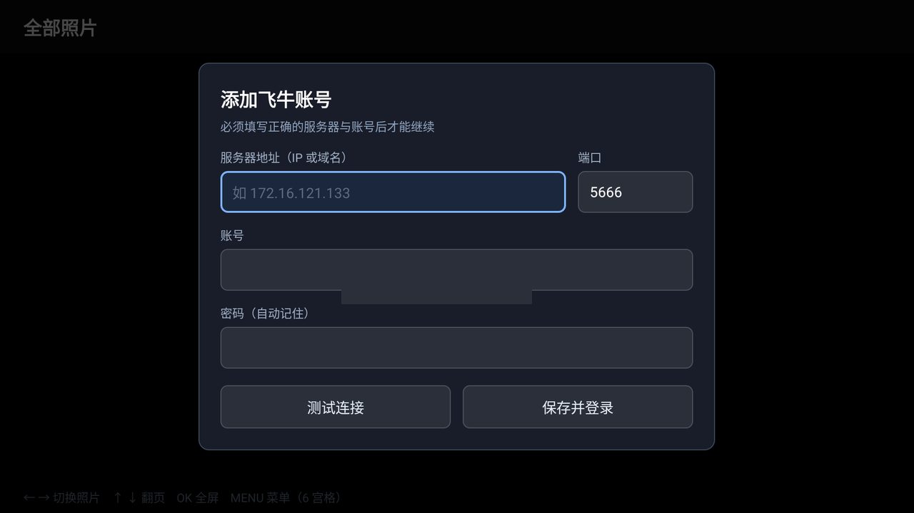
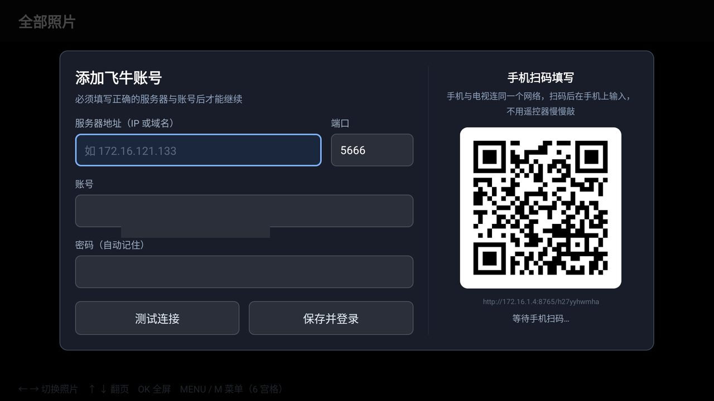
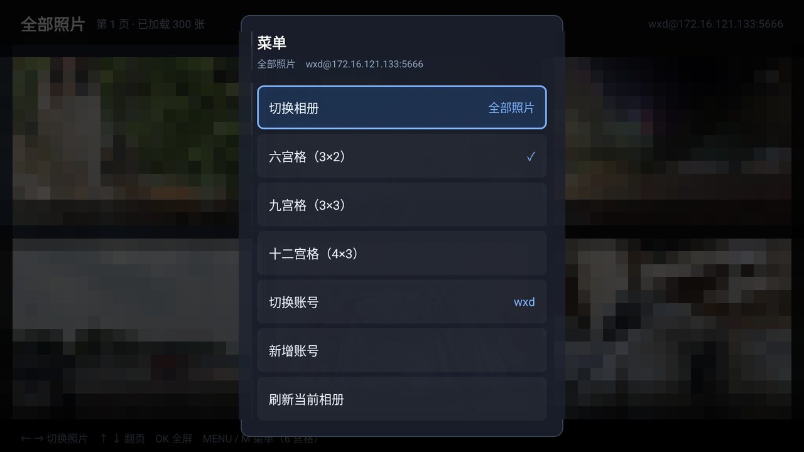
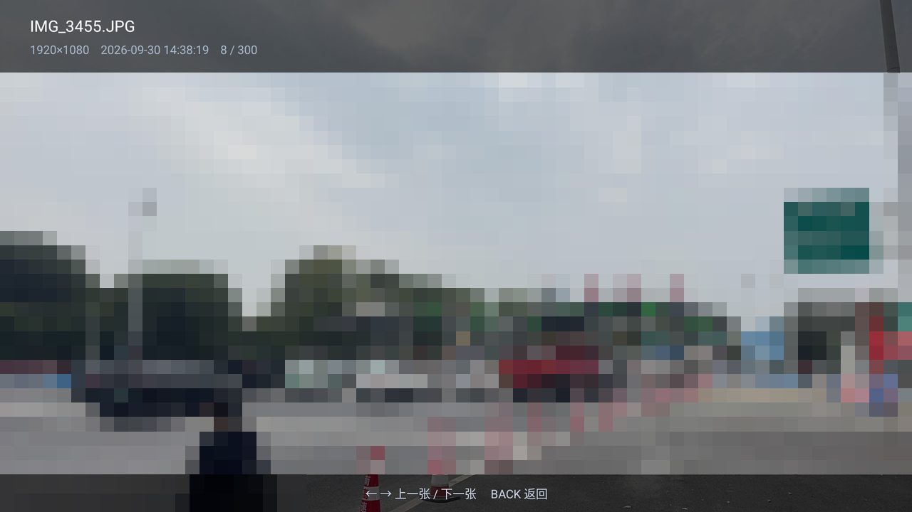
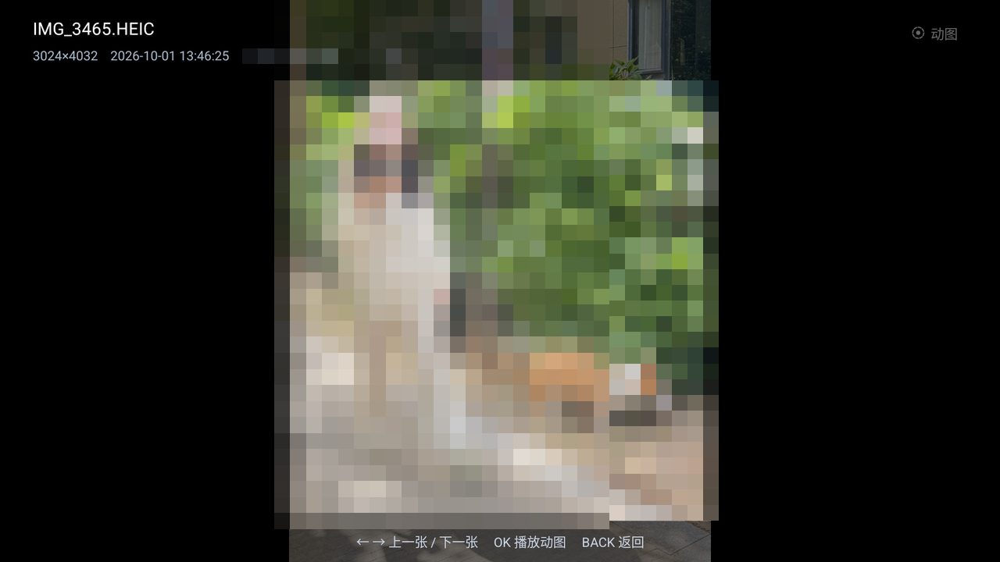
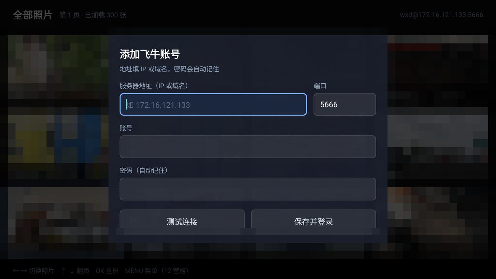
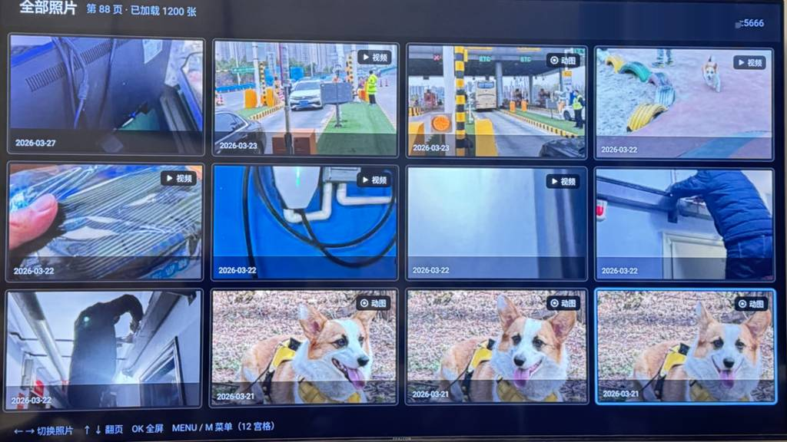

<div align="center">

# 飞牛相册 TV 版

**在电视上，用遥控器刷飞牛 NAS 里的照片。**

[](#)
[](#)
[-blue)](#)
[](LICENSE)

</div>

---

**飞牛相册 TV 版（FnAlbum TV）** 是一个第三方开源的 Android TV 客户端，用来在电视 / 电视盒子上浏览
**飞牛 fnOS** 的相册。整个应用是纯 Kotlin 实现的，**不含任何 native 库**，所以从 x86 模拟器到
ARM 电视盒子都能直接装，不用为架构挑包。

> 本项目与飞牛官方无关，是非官方第三方客户端，仅调用用户自己 NAS 的公开接口。

## 目录

- [功能特性](#功能特性)
- [截图](#截图)
- [下载安装](#下载安装)
- [快速上手](#快速上手)
- [遥控器按键](#遥控器按键)
- [常见问题](#常见问题)
- [从源码构建](#从源码构建)
- [项目结构](#项目结构)
- [技术说明](#技术说明)
- [调试与构建](#调试与构建)
- [更新日志](#更新日志)
- [贡献](#贡献)
- [免责声明](#免责声明)
- [开源协议](#开源协议)
- [赞助](#赞助)

## 功能特性

| 功能 | 说明 |
| --- | --- |
| 📺 **为电视而生** | 横屏、大字号、焦点高亮，全部操作都能只用遥控器完成 |
| 🔑 **登录弹窗** | 首启 / 登录失败自动弹出，填 IP（或域名）、端口、账号、密码；**密码本地记住** |
| 📱 **扫码登录** | 弹窗右侧直接显示二维码，手机扫码在网页上填表，点一下就把账号发到电视并自动登录，**彻底告别遥控器打字** |
| 👥 **多账号** | 账号列表持久化，随时切换、随时删除 |
| 🔲 **三档宫格** | 六宫格 3×2（默认）/ 九宫格 3×3 / 十二宫格 4×3，选择结果会记住 |
| 🕹️ **顺手的浏览** | ← → 切换照片，↑ ↓ 整页翻页，OK 进全屏；进全屏后 ← → 直接切上一张 / 下一张 |
| 🎬 **视频播放** | 视频进全屏自动播一次，按 OK 可再播，播完回到静态图 |
| 🌀 **实况照片（动图）** | iPhone 的 Live Photo 会带「动图」角标，进全屏先看静态图，按 OK 播放一次 |
| 🔊 **动图带声音** | 播放内核用 Media3/ExoPlayer，能解 iPhone 实况短片里的 `lpcm` 音轨，**不再无声播放** |
| ⏳ **不黑屏的等待** | 点开后先在原图上转 loading，等视频首帧真正就绪才切过去，**不会先黑屏几秒** |
| 🏷️ **媒体角标** | 视频显示「▶ 视频」，动图显示「◉ 动图」，都在格子右上角 |
| ℹ️ **全屏信息栏** | 显示文件名、分辨率、拍摄时间、当前序号 |
| 🔌 **零 native 依赖** | 纯 JVM 字节码，x86 / armeabi-v7a / arm64 通用，APK 约 4.6 MB |

## 截图

电视实机拍摄效果（手机拍的，十二宫格）：


模拟器 1920×1080 界面截图：

| 登录弹窗 | 扫码登录 | 菜单键 |
| --- | --- | --- |
|  |  |  |

| 全屏查看 | 视频播放 | 实况照片 |
| --- | --- | --- |
|  |  |  |

| 新增账号 | 十二宫格 | |
| --- | --- | --- |
|  |  | |

## 下载安装

从 [Releases](../../releases) 或仓库里的 [`dist/`](dist) 目录取 APK：

```bash
adb install -r dist/FnAlbum-TV-v1.3.3.apk
```

也可以把 APK 拷进 U 盘插到电视上，用电视自带的文件管理器安装。首次安装需要允许
「未知来源应用」。

**运行要求**

| 项目 | 要求 |
| --- | --- |
| 系统 | Android 5.0（API 21）及以上 |
| 设备 | Android TV / 电视盒子 / 手机 / 平板 / 模拟器均可 |
| 飞牛 | 需要能访问到你的 fnOS 服务器，默认端口 `5666` |
| 无网络限制 | 应用不依赖任何第三方服务，只连你自己的 NAS |

## 快速上手

### 方式一：手机扫码登录（推荐）

遥控器输入 IP 和密码实在折磨人，所以首选扫码：

1. 电视上打开应用，首次启动会自动弹出登录窗；
2. 弹窗**右侧**会出现一个二维码，用**手机相机 / 微信 / 支付宝**随便扫；
3. 手机会打开一个局域网页面，在手机上填 **服务器地址、端口、账号、密码**；
4. 点「发送到电视」，电视端立刻收到并自动登录，二维码服务随即关闭。

> 手机和电视需要在同一个局域网。二维码地址形如 `http://192.168.1.x:8765/<随机token>`，
> token 是一次性随机的，登录窗口一关端口就释放，不会长期监听。

### 方式二：遥控器直接输入

在弹窗里用方向键移动到输入框，按 OK 调出软键盘输入即可。字段说明：

| 字段 | 说明 |
| --- | --- |
| 服务器地址（IP 或域名） | 例如 `192.168.1.100`；带 `http://` / `https://` 前缀也可以 |
| 端口 | 默认 `5666`，留空即默认 |
| 账号 | 飞牛登录账号 |
| 密码 | 会保存在本地，下次直接登录 |

## 遥控器按键

**首页**

| 按键 | 作用 |
| --- | --- |
| ← / → | 上一个 / 下一个（跨行连续移动） |
| ↑ / ↓ | 上一页 / 下一页 |
| OK / 回车 | 打开全屏查看 |
| **菜单 / 设置 / INFO / 键盘 M** | 打开菜单 |

**菜单内容**：切换相册 · 六宫格 · 九宫格 · 十二宫格 · 切换账号 · 新增账号 · 刷新当前相册。

> 没有菜单键的遥控器或笔记本键盘，直接按 **M** 键即可（在登录弹窗的输入框里按 M 会正常输入字母 m，
> 不会误触发菜单）。

**全屏查看**

| 按键 | 作用 |
| --- | --- |
| ← / ↑ / 上一曲 / PageUp | 上一张 |
| → / ↓ / 下一曲 / PageDown | 下一张 |
| OK / 回车 / 媒体播放暂停 | 播放视频或动图（点一次播一次，不自动循环） |
| BACK | 返回网格 |

## 常见问题

<details>
<summary><b>连不上 / 一直登录失败？</b></summary>

- 确认电视和 NAS 在同一网络，先在手机浏览器打开 `http://<NAS IP>:5666` 看能不能访问；
- 确认端口是 `5666`（飞牛默认端口，若你改过就填改后的）；
- 账号密码区分大小写，注意别把 `O`/`0` 搞混；
- 如果之前存过错误密码，进菜单 →「切换账号」→ 删除该账号，重新添加。
</details>

<details>
<summary><b>某些照片转圈打不开？</b></summary>

缩略图由 NAS 实时生成，超大图（例如 100 MP 的 RAW 导出）第一次打开会慢一点，属正常现象。
十二宫格用的是更小的缩略图档位，加载会更快。
</details>

<details>
<summary><b>动图角标是怎么来的？点开却播不了？</b></summary>

角标只在服务端同时满足「`isLive=1`」**且**「短片地址已索引」时才显示。只有 `isLive=1`
但短片还没被 NAS 索引出来的条目，播放必然失败，因此不给角标。
</details>

<details>
<summary><b>为什么用 Media3/ExoPlayer，而不是系统自带的播放器？</b></summary>

因为**动图短片是没声音的重灾区**。实况照片的短片是 MOV 容器 + `lpcm`（未压缩 PCM）
音轨，系统 `MediaPlayer` / `MPEG4Extractor` 会把这条音轨整条丢掉：画面照播、完全无声。
换成 Media3/ExoPlayer 后，它的 `Mp4Extractor` 认得这条抽样条目，声音就回来了。

它同样是纯 JVM 字节码、不带 `.so`，x86 / armeabi-v7a / arm64 通用；代价是 APK 大了约 2 MB。
</details>

<details>
<summary><b>动图点开还是没声音？</b></summary>

先确认电视/盒子的**媒体音量**不是 0 或静音（注意不是「通知音量」）。如果音量正常仍无声，
接 adb 看一眼整条音频链路（播放时会打一行）：

```bash
adb logcat -s FnAlbumTV:I
# 音频链路 音轨组=1 已选=1 player音量=1.0 系统媒体音量=5/15 静音=false 输出设备=2:speaker|18:bus
# AudioTrack: stop(27): called with 136604 frames delivered
```

`音轨组=0` 说明这条短片服务端侧就没有音轨（NAS 的问题）。如果像上面这样
**音轨被选中、系统媒体音量不为 0、也没静音，并且有 `frames delivered`**，
那说明声音已经交给系统了，问题在输出侧：**音频输出模式**是否被设成了
「透传 / Bitstream」（`lpcm` 是 PCM，透传下会被丢，改成 **PCM / 自动**）、
有没有蓝牙耳机/音响抢占输出、HDMI 接的是哪个口。
</details>

<details>
<summary><b>点开动图 / 视频会黑屏等几秒吗？</b></summary>

不会。按下 OK 之后，屏幕上一直是原来那张静态图，只在中间转一个 loading；
等视频首帧真正渲染出来才把静态图收掉、切换成播放画面。所以等待期间不会有黑屏。
如果网络异常、20 秒还没准备好，会退回静态图并提示「加载超时，按 OK 重试」。
</details>

<details>
<summary><b>安全吗？应用会把我的账号发到哪去？</b></summary>

不会外发。登录走的是 NAS 自己的 WebSocket 加密通道，密码只存在设备本地 SharedPreferences 里。
扫码登录用的局域网页面只在你自己的局域网内提供，且 URL 带一次性随机 token，窗口关闭即停止监听。
</details>

## 从源码构建

**环境**

| 依赖 | 版本 |
| --- | --- |
| JDK | 17 |
| Android SDK | Platform 34 / Build-Tools 34 |
| Gradle | 8.12（或用仓库自带的 wrapper） |

在项目根目录建一个 `local.properties`，写上你的 SDK 路径：

```properties
sdk.dir=C\:\\Android\\Sdk
```

然后构建：

```bash
export JAVA_HOME="<你的 JDK 17 路径>"
./gradlew :app:assembleDebug --console=plain     # Windows: gradlew.bat
```

产物在 `app/build/outputs/apk/debug/app-debug.apk`。

> `gradle/wrapper/gradle-wrapper.properties` 里默认用的是**腾讯云镜像**（国内下载快），
> 想换回官方源把 `distributionUrl` 改回 `https://services.gradle.org/distributions/gradle-8.12-bin.zip` 即可。
>
> 也可以用 Android Studio 直接 Open 这个目录（选 `build.gradle.kts`），
> 由 IDE 完成构建和安装。

> 若依赖下载慢，可在 **`~/.gradle/gradle.properties`**（注意是用户目录，不是仓库内）加代理：
>
> ```properties
> systemProp.https.proxyHost=127.0.0.1
> systemProp.https.proxyPort=7897
> ```
>
> 仓库内的 `gradle.properties` 刻意只保留与机器无关的配置，避免污染他人环境。

## 项目结构

```
app/src/main/java/com/fnalbum/tv/
├── FnCrypto.kt         签名算法 + RSA/AES 加密（已用真实服务器回包逐字节验证）
├── Api.kt              WebSocket 加密登录 + HTTP 业务接口 + 媒体流地址
├── Model.kt            Account / Photo / Album / MediaKind（视频 · 动图 · 普通）
├── Prefs.kt            多账号与偏好持久化
├── Repo.kt             照片分页加载与去重
├── App.kt              Coil 图片加载器（拦截器注入 AccessToken）
├── PhotoGridLayout.kt  固定行列网格容器
├── MainActivity.kt     网格浏览 + 遥控器交互 + 菜单
├── ViewerActivity.kt   全屏查看器 + 视频 / 动图播放
├── UiDialogs.kt        登录弹窗 + 遥控器友好的列表弹窗
├── QrCode.kt           二维码生成
└── QrLoginServer.kt    局域网扫码登录服务（页面 + 提交接口）
```

角标图标：`res/drawable/ic_badge_video.xml`（播放三角）、`ic_badge_live.xml`（虚线同心环），
底色统一用 `badge_bg.xml`。

## 技术说明

飞牛服务端有两条链路，缺一不可，实现细节与踩坑记录整理在
**[docs/PROTOCOL.md](docs/PROTOCOL.md)**，包括：

- WebSocket 加密登录（RSA 公钥 + AES-256-CBC）的完整包格式
- HTTP 接口的 `authx` 签名算法（`salt_path_nonce_timestamp_paramHash_secret`）
- 缩略图与媒体流的鉴权差异、缩略图各档位实测分辨率
- **两个致命坑**：`si` 字段必须原样按字符串回传（否则 `errno 8192`）、
  `getList` 的 `end_time` 必须补全到 `23:59:59`

> 本项目只调用用户自有设备上的接口，不包含任何服务端代码，也不绕过任何付费 / 授权机制。

## 调试与构建

仓库 `tools/` 下保留两个辅助脚本：

| 脚本 | 用途 |
| --- | --- |
| `tools/make-screenshots.py` | 把 `_shots/` 里的原始截图打码脱敏并压到 100 KB 以内 |
| `tools/make-release.py` | 打 tag、创建 GitHub Release 并上传 APK |

用法见 **[docs/DEVELOPMENT.md](docs/DEVELOPMENT.md)**（含模拟器联调、按键注入、Git Bash 踩坑）。

## 更新日志

| 版本 | 内容 |
| --- | --- |
| **v1.3.3** | 音频自检改为只写日志（`adb logcat -s FnAlbumTV:I` 看「音频链路」那一行），界面上不再显示任何调试标记 |
| **v1.3.2** | 修复播放画面**被拉伸铺满整屏**：换成 `SurfaceView` 后丢了原来 `VideoView` 自带的比例适配，现按片源比例居中缩放，多余部分留黑边；另外登录日志不再打印明文密码与 token |
| **v1.3.1** | 修复实况照片短片**没有声音**：动图短片是 MOV 容器 + `lpcm`（未压缩 PCM）音轨，系统播放器会整条丢弃；播放内核换成 **Media3/ExoPlayer** 后正常出声 |
| **v1.3** | 实况照片/视频播放**不再黑屏等待**：等到视频首帧就绪才揭开画面，等待期间保留当前图片与 loading 提示 |
| v1.2 | 登录弹窗新增**扫码登录**：手机填表，电视自动接收并登录 |
| v1.1 | 视频与实况照片播放（点一次播一次）；键盘 **M** 键等同菜单键；媒体角标 |
| v1.0 | 首个版本：登录弹窗、多账号、三档宫格、遥控器浏览、全屏查看 |

## 贡献

欢迎 Issue 和 PR。提 PR 前建议：

1. 在雷电模拟器或真机上手动过一遍受影响的交互（登录、遥控器按键、全屏查看等）；
2. 保持「零 native 依赖」，不要引入带 `.so` 的库；
3. 新增设置项时记得落到 `Prefs.kt`，并保证遥控器可以完整操作。

不同型号遥控器的键码差异很大，如果你的遥控器某个键没反应，欢迎带上
`adb shell getevent -lt` 的输出提 Issue，我把键码加进去。

## 免责声明

- 本项目是**非官方**第三方客户端，与飞牛（fnOS）官方无任何关系；
- 仅供学习交流与个人合法使用，请勿用于任何商业用途；
- 请使用**自己的**账号登录**自己的**设备；
- 使用本软件产生的任何后果由使用者自行承担。

## 开源协议

[MIT License](LICENSE) © 2026 王向东（HelloWangXiangDong）

## 赞助

如果这个小工具帮你解决了「在电视上看 NAS 照片」的痛点，可以请作者喝杯咖啡 ☕

<div align="center">

| 微信 | 支付宝 |
| :---: | :---: |
|  |  |

</div>

赞助完全自愿，不影响项目的任何功能与开源程度。比起赞助，**给个 Star ⭐ 或者提个 Issue** 对作者来说更开心。
